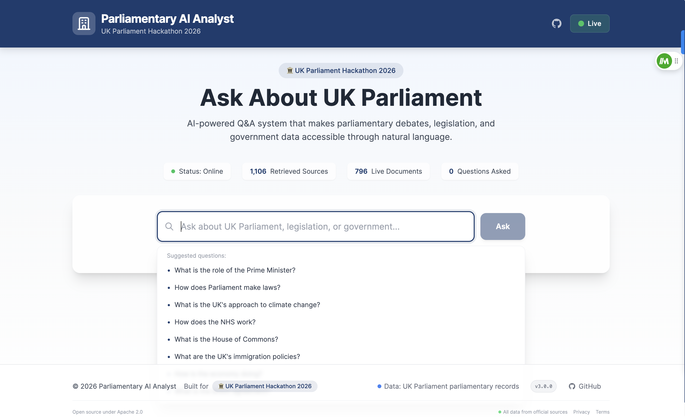

# 🏛️ Parliamentary AI Analyst

<div align="center">

[](https://parliamentary-ai-analyst.vercel.app)
[](https://parliamentary-ai-analyst-backend.onrender.com/health)
[](LICENSE)
[](https://github.com/FarhanT17/parliamentary-ai-analyst)
[](https://www.python.org/)
[](https://reactjs.org/)
[](https://fastapi.tiangolo.com/)

> **AI-powered Q&A system that makes parliamentary debates, legislation, and government data accessible through natural language.**

</div>

## 📸 Screenshots

<div align="center">

### Home Page


*The main interface where users can ask questions about UK Parliament*

### Answer Example


*Example response showing source-grounded answer with citations*

</div>

----

## 📖 Overview

The **Parliamentary AI Analyst** is an intelligent question-answering system built for the **UK Parliament Hackathon 2026**. It combines **Retrieval-Augmented Generation (RAG)** with **hybrid search** to provide accurate, source-grounded answers about UK Parliament, legislation, and government processes.

### 🎯 Key Features

| Feature | Description |
|---------|-------------|
| 🔍 **Hybrid Search** | Combines semantic (FAISS) and keyword (TF-IDF) retrieval for optimal results |
| 📚 **Source-Grounded Answers** | Every answer cites its parliamentary sources for transparency |
| 🏛️ **UK Parliament Focus** | Specialized in parliamentary data, debates, and legislation |
| 🌐 **Live Demo** | Fully deployed and accessible online |
| 📱 **Responsive UI** | Works seamlessly on desktop, tablet, and mobile |
| 🚀 **Lightweight** | Optimized for free hosting tiers with minimal resource usage |
| ⚡ **Fast Response** | Optimized retrieval pipeline for quick answers |

### 🧠 How It Works

┌─────────────────────────────────────────────────────────────────┐
│ 1. Ask a Question │
│ "What is the role of the PM?" │
└─────────────────────────────────────────────────────────────────┘
│
▼
┌─────────────────────────────────────────────────────────────────┐
│ 2. Hybrid Retrieval │
│ ┌─────────────────────┐ ┌─────────────────────────────┐ │
│ │ Semantic Search │ │ Keyword Search (TF-IDF) │ │
│ │ (FAISS) │ │ │ │
│ └─────────────────────┘ └─────────────────────────────┘ │
│ │ │ │
│ ▼ ▼ │
│ ┌──────────────────┐ │
│ │ Hybrid Results │ │
│ └──────────────────┘ │
└─────────────────────────────────────────────────────────────────┘
│
▼
┌─────────────────────────────────────────────────────────────────┐
│ 3. Source Prioritization │
│ Identifies authoritative parliamentary sources │
│ (Glossary, Hansard, Commons Library, etc.) │
└─────────────────────────────────────────────────────────────────┘
│
▼
┌─────────────────────────────────────────────────────────────────┐
│ 4. Answer Generation │
│ Provides concise, evidence-backed responses │
│ with proper citations │
└─────────────────────────────────────────────────────────────────┘
│
▼
┌─────────────────────────────────────────────────────────────────┐
│ 5. Response │
│ "The Prime Minister is the leader of the Government..."│
│ Source: UK Parliament Glossary │
└─────────────────────────────────────────────────────────────────┘


---

## 🚀 Live Demo

| Service | URL | Status |
|---------|-----|--------|
| **Frontend** | [parliamentary-ai-analyst.vercel.app](https://parliamentary-ai-analyst.vercel.app) | ✅ Live |
| **Backend API** | [parliamentary-ai-analyst-backend.onrender.com](https://parliamentary-ai-analyst-backend.onrender.com) | ✅ Live |
| **API Health** | [parliamentary-ai-analyst-backend.onrender.com/health](https://parliamentary-ai-analyst-backend.onrender.com/health) | ✅ Healthy |
| **API Docs** | [parliamentary-ai-analyst-backend.onrender.com/docs](https://parliamentary-ai-analyst-backend.onrender.com/docs) | ✅ Live |

### 💬 Try It Out

Ask questions like:
- 💭 *"What is the role of the Prime Minister?"*
- 📜 *"How does Parliament make laws?"*
- 🏛️ *"What is the House of Commons?"*
- 🏥 *"How does the NHS work?"*
- 🌍 *"What is the UK's approach to climate change?"*
- 🗳️ *"What are the UK's immigration policies?"*
- 💰 *"How is the economy doing?"*
- 🇪🇺 *"What is the Brexit agreement?"*

---

## 🛠️ Technology Stack

### Backend

| Technology | Purpose |
|------------|---------|
| **[FastAPI](https://fastapi.tiangolo.com/)** | Modern Python web framework with async support |
| **[LangChain](https://python.langchain.com/)** | RAG and LLM orchestration framework |
| **[FAISS](https://github.com/facebookresearch/faiss)** | Vector search for semantic retrieval |
| **[Sentence-Transformers](https://www.sbert.net/)** | Embeddings for semantic search |
| **[scikit-learn](https://scikit-learn.org/)** | TF-IDF keyword retrieval |
| **[Uvicorn](https://www.uvicorn.org/)** | ASGI server for FastAPI |

### Frontend

| Technology | Purpose |
|------------|---------|
| **[React](https://reactjs.org/)** | Modern UI framework |
| **[Vite](https://vitejs.dev/)** | Fast build tool and dev server |
| **[Tailwind CSS](https://tailwindcss.com/)** | Utility-first CSS framework |
| **[Axios](https://axios-http.com/)** | HTTP client for API calls |

### Infrastructure

| Platform | Purpose |
|----------|---------|
| **[Render](https://render.com/)** | Backend hosting (Free Tier) |
| **[Vercel](https://vercel.com/)** | Frontend hosting (Free Tier) |
| **[GitHub](https://github.com/)** | Version control & CI/CD |

---

## 📁 Project Structure

parliamentary-ai-analyst/
├── backend/
│ ├── app/
│ │ ├── init.py
│ │ ├── main.py # FastAPI application entry point
│ │ ├── config.py # Configuration settings
│ │ ├── real_rag_engine.py # Main RAG engine (heavy)
│ │ ├── real_rag_engine_light.py # Lightweight version for free tier
│ │ ├── data_collector.py # Parliamentary data collection
│ │ ├── chunking.py # Document chunking
│ │ └── hybrid_retriever.py # Hybrid search implementation
│ ├── data/
│ │ └── processed/ # Processed parliamentary data
│ ├── requirements.txt # Full dependencies
│ ├── requirements-light.txt # Lightweight dependencies
│ └── Dockerfile
├── frontend/
│ ├── src/
│ │ ├── components/
│ │ │ ├── Header.jsx
│ │ │ ├── Footer.jsx
│ │ │ ├── SearchBar.jsx
│ │ │ └── ResultCard.jsx
│ │ ├── App.jsx # Main application component
│ │ └── index.css # Global styles
│ ├── package.json
│ ├── vite.config.js
│ └── .env.production
├── render.yaml # Render deployment config
├── vercel.json # Vercel deployment config
├── Dockerfile
├── docker-compose.yml
└── README.md


---

## 🔧 Local Development

### Prerequisites

| Requirement | Version |
|-------------|---------|
| Python | 3.11+ |
| Node.js | 18+ |
| npm or yarn | Latest |
| Git | Latest |

### 🐍 Backend Setup

```bash
# Clone the repository
git clone https://github.com/FarhanT17/parliamentary-ai-analyst.git
cd parliamentary-ai-analyst

# Navigate to backend
cd backend

# Create virtual environment
python -m venv venv
source venv/bin/activate  # On Windows: venv\Scripts\activate

# Install dependencies
pip install -r requirements.txt

# Create .env file
cat > .env << 'EOF'
OPENAI_API_KEY=your_api_key_here
COLLECT_FRESH_DATA=false
USE_SAMPLE_FALLBACK=true
EOF

# Run the backend
python -m uvicorn app.main:app --reload --host 0.0.0.0 --port 8000


### 🎨 Frontend Setup

# Navigate to frontend
cd frontend

# Install dependencies
npm install

# Create .env file
echo "VITE_API_URL=http://localhost:8000" > .env

# Run the frontend
npm run dev


### 🌐 Access the App
Service	URL
Frontend	http://localhost:5173
Backend API	http://localhost:8000
API Docs	http://localhost:8000/docs

🚀 Deployment Guide
📦 Deploy Backend to Render
Fork/clone the repository

Go to render.com

Click "New +" → "Web Service"

Connect your GitHub repository

Configure with these settings:

Setting	Value
Build Command	cd backend && pip install --no-cache-dir -r requirements-light.txt
Start Command	cd backend && uvicorn app.main:app --host 0.0.0.0 --port $PORT
Plan	Free
Add environment variables

Click "Deploy"

🌐 Deploy Frontend to Vercel


cd frontend
echo "VITE_API_URL=https://your-backend-url.onrender.com" > .env.production
npm run build
npx vercel --prod


📊 API Reference
🔍 Health Check

GET /health

Response:

json
{
  "status": "healthy",
  "service": "parliamentary-ai-analyst",
  "version": "3.0.0",
  "timestamp": "2026-09-08T13:58:39.021790+00:00"
}

❓ Ask a Question

POST /ask
Content-Type: application/json

{
  "query": "What is the role of the Prime Minister?"
}
Response:

json
{
  "answer": "The Prime Minister is the leader of the Government...",
  "sources": [],
  "evidence_count": 0,
  "is_demo_answer": true,
  "timestamp": "..."
}

🧪 Testing
Backend Testing
# Health check
curl https://parliamentary-ai-analyst-backend.onrender.com/health

# Test a question
curl -X POST "https://parliamentary-ai-analyst-backend.onrender.com/ask" \
  -H "Content-Type: application/json" \
  -d '{"query": "What is the role of the Prime Minister?"}' \
  | python3 -m json.tool

Frontend Testing
bash
# Run tests
npm test

# Lint
npm run lint

# Build
npm run build


🤝 Contributing
Contributions are welcome! Please follow these steps:

Fork the repository

Create a feature branch: git checkout -b feature/AmazingFeature

Commit your changes: git commit -m 'Add some AmazingFeature'

Push to the branch: git push origin feature/AmazingFeature

Open a Pull Request


📜 License
This project is licensed under the Apache License 2.0 - see the LICENSE file for details.

🙏 Acknowledgments
UK Parliament Hackathon 2026 - Inspiration and opportunity

UK Parliament APIs - Providing the data

OpenAI - LLM capabilities

LangChain - RAG framework

FAISS - Vector search

Render & Vercel - Free hosting


📞 Contact
Author	Farhan Tariq
Email	farhantariq5251@gmail.com
GitHub	FarhanT17
Project	parliamentary-ai-analyst
